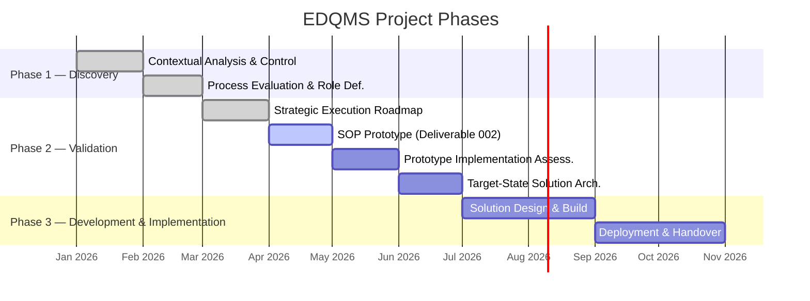

# The Project

In January 2026, Siemens Energy engaged Neun Design to support the establishment of a Global Engineering Hub for power transformer repair. The engagement began with a consulting proposal to map existing process gaps and define the competencies required for the new engineering team.

What started as a process-mapping exercise evolved, through discovery, into something more fundamental: the design and validation of a quality management methodology capable of answering one decisive question across all operations:

> *"When something happens, will we know when to act, what is required, and how to execute it all?"*

That question — and the system being built to answer it — is what this project is about.

## Context

The Global Engineering Hub was established to serve business units distributed across multiple regions, including Nuremberg, Charlotte, Linz, and Weiz. Its engineers support both repair factories (complex scopes) and service units (field-based, simpler scopes). Each business unit pays a monthly fee in exchange for forecasted engineering hours.

From the outset, two gaps were identified:

1. **Demand clarity** — Business units could not substantiate the engineering hours they had projected. The hub lacked a clear picture of the service scopes it would deliver.
2. **Execution clarity** — Process maps described ideal future states but did not document how work should actually be done today. Managers and engineers could not connect daily tasks to requirements and objectives.

These two gaps feed the same root cause: the absence of a consistent, intelligible record of findings made and decisions taken. Without such a record there is no traceability of strategy. Successes cannot be replicated. Mistakes recur. Onboarding new team members becomes a slow, informal process that transfers risk rather than knowledge.

This is not a minor operational gap — it is a **governance problem**. And it must be addressed at the start of an initiative, not retrofitted after the damage has compounded.

## Project Question

The workshop conducted during Phase 1 distilled the operational challenge into a single question:

> *"When something happens, will we know when to act, what is required, and how to execute it all?"*

This is not a staffing question. It is a knowledge and execution architecture question. The EDQMS project is the structured answer.

## The Three Phases

| Phase | Name | Status | Purpose |
| :--- | :--- | :--- | :--- |
| 1 | Discovery | Completed | Map the current state, identify gaps, define the project question |
| 2 | Validation | In progress | Build and validate the SOP prototype against a real case study |
| 3 | Development and Implementation | Planned | Transform the validated prototype into a deployable system |

Each phase builds on the previous. Phase 1 produced the diagnosis. Phase 2 validates the remedy. Phase 3 delivers it at scale.

## Return on Effort

The value this project delivers is not theoretical. A quality management system built on structured, event-driven procedures directly reduces the cost of operational ambiguity. The three concrete organisational outcomes are:

| Outcome | What it means in practice |
| :--- | :--- |
| **Onboarding speed** | New hires have a documented system to reference from day one — reducing dependence on informal knowledge transfer and individual availability |
| **Cross-regional consistency** | Any qualified engineer in any region can execute a procedure correctly, without relying on institutional memory held in a specific location |
| **Governance at scale** | As the hub grows, quality controls scale with it — embedded in the execution architecture rather than layered on top as periodic audits |

These outcomes are the reason the investment in building the system correctly from the start — rather than accumulating informal processes that will later require expensive remediation — is justified.

### Operations become both reactive and predictive

A purely reactive operation responds to problems after they occur. A purely predictive one attempts to anticipate all scenarios in advance — which, in practice, produces process libraries that are never used.

EDQMS enables a third mode: **structured reactivity**. When an operational event occurs, the system already knows which process applies, what requirements are in scope, and how to execute the response. Changes to internal structure or external conditions are handled not by rebuilding from scratch, but by updating the specific nodes — sources, requirements, constraints, payloads — that govern the affected operations.

This makes the operation resilient to change without sacrificing the consistency that ISO 9001:2015 requires.
