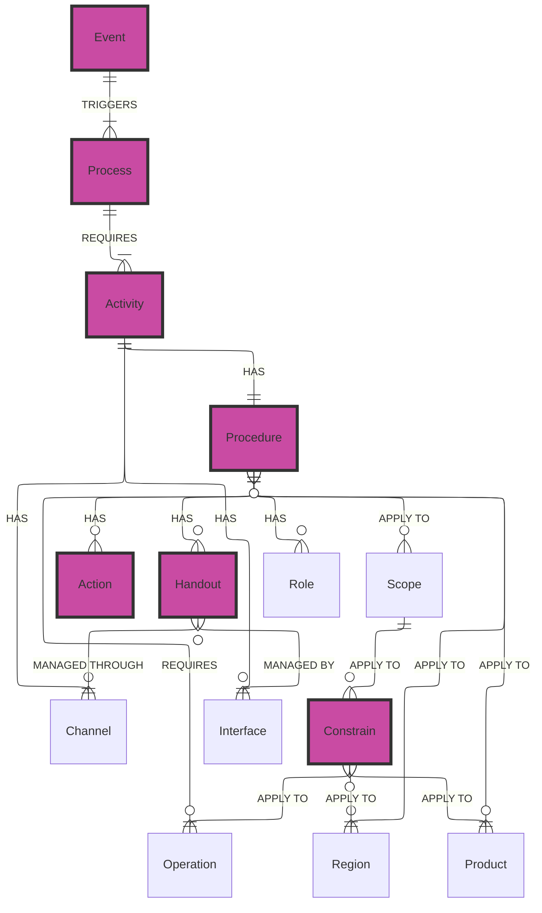

# Prototype Structure
The EDQMS prototype is built on a deliberately simplified data model. Its purpose is not to validate the full EDQMS system architecture — it is to validate whether the **SOP template structure** can handle the complexity of the Engineering Hub's events. Every entity in the model exists because removing it would leave part of the project question unanswered.

!!! Info "Definition"

    A **data model** defines what information exists, how it is structured, and how different pieces of information are connected.

## Data Model

The prototype consists of seven operational entities (bright purple) and seven structural entities (translucent purple), implemented as Microsoft SharePoint Lists. Together, they form a complete, traceable quality chain from the operational trigger to the documented output.

!!! Abstract "Entity Relation Diagram"

    An ERD shows what information exists and how different pieces of information relate to each other. In the end, a entity is nothing but a table (or a MS List) stored in some database. The diagram shows the relation between each table.
    
    ??? Note "Operationl vs Structure Entities"

        In the diagram above, a total of 14 entities are defined, each supported by a corresponding Microsoft List that must be populated.
        The entities highlighted in bright purple represent what we refer to as **operational entities**. These entities require continuous data entry and maintenance because each record is created on a case-by-case basis, reflecting specific occurrences within the workflow. In other words, they capture the dynamic, execution-level aspects of the business and correspond to transactional data.
        The remaining entities, shown in translucent purple, are classified as **structural entities**. These are created once and maintained with relatively low frequency. They provide the foundational structure of the system—such as classifications, rules, and standard definitions—and are typically used as reference data to ensure consistency and governance across operational activities.

This chain answers all three dimensions of the project question simultaneously:

- **"When to act"** — the Event defines the trigger
- **"What is required"** — the Process, Activity, and Constraints define the requirements
- **"How to execute it"** — the Procedure, Actions, and Handouts define the execution method and its expected outputs

## Operational Entities

### Event

**What it represents:** Any occurrence within the operation that initiates a quality management response — a customer request, a technical deviation, a design decision point, or a handover between teams.

**Role:** The entry point. By logging an Event, the team activates the set of Processes, Activities, and Procedures that define the correct response.

**ISO 9001:2015 reference:** §4.4.1(f) — processes must address the risks and opportunities determined in clause 6.1. The Event is the real-time detection mechanism.

---

### Process

**What it represents:** A top-level business activity performed in response to an Event — for example, Technical Offer Development, Design Review, or Repair Scope Definition.

**Role:** A single Event can trigger one or more Processes. Each Process has a defined owner, scope, and set of required Activities.

**ISO 9001:2015 reference:** §4.4.1 — the organisation must establish, implement, maintain, and continually improve QMS processes and their interactions.

---

### Activity

**What it represents:** A sub-process or specific task within a Process — for example, within Technical Offer Development: Scope Definition, Cost Estimation, Technical Drawing Review.

**Role:** The unit of execution. An Event can also directly require a specific Activity, enabling targeted responses without activating the entire Process chain.

**ISO 9001:2015 reference:** §4.4.1(b) — the sequence and interaction of processes. Activities represent the second level of decomposition.

---

### Procedure

!!! Danger "System Anchor"

    The Standard Operating Procedure (SOP) is the central entity that integrates all other elements of the data model. It acts as the point where structural data is combined into a coherent and executable definition of how work should be performed. Because of this central role, validating the SOP template effectively means validating the entire EDQMS structure.

**What it represents:** The documented method for executing a specific Activity. It answers: *how exactly should this Activity be carried out?* It captures steps, responsible roles, required tools, applicable constraints, and expected outputs.

**Role:** The core deliverable of the prototype. When a Procedure is correctly defined, any team member — regardless of location or prior experience — knows what to do.

**ISO 9001:2015 reference:** §4.4.2(a) — the organisation must maintain documented information to support the operation of its processes.

---

### Constraints

**What it represents:** Regulatory, contractual, or technical limits that bound how a Procedure may be executed — for example, IEC standards governing insulation testing, or customer contractual requirements for hold points.

**Role:** Prevents improvisation that introduces non-conformity risk. A team member executing a Procedure sees both the steps and the limits within which those steps must remain.

**ISO 9001:2015 reference:** §4.3 — QMS scope must consider external and internal issues and the requirements of interested parties.

---

### Actions

**What it represents:** Discrete quality management interventions associated with a Procedure — quality gates embedded within execution steps, such as inspection checkpoints, sign-off requirements, or corrective measures.

**Role:** Ensures execution is not only efficient but controlled. An Action record identifies what must be done, who is responsible, and under what conditions it applies.

**ISO 9001:2015 reference:** §6.1.2 — the organisation must plan actions to address risks and opportunities and integrate them into QMS processes.

---

### Handouts

**What it represents:** The inputs and outputs — documents, completed forms, technical specifications, or drawing revisions — produced or consumed during the execution of a Procedure.

**Role:** Makes quality measurable. If the correct Handout has been produced, the Activity was completed. If it has not, the gap is immediately visible.

**ISO 9001:2015 reference:** §4.4.2(b) — retained documented information as evidence of conformity.

