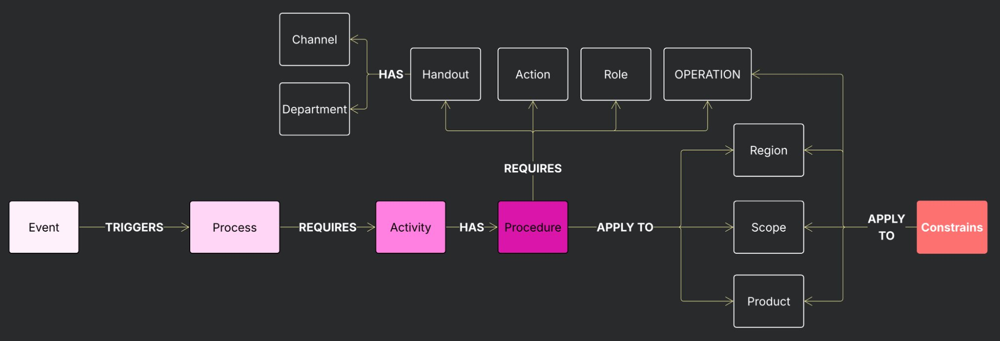

--- 
content-type: instruction
subject: 
  - datamodel
  - prototype
--- 

# Attachment B — Standard Operational Procedures Template
### Deliverable 002 · PRP-C-0017 · Neun Design for Siemens Energy

---

## 1. Purpose

This attachment describes the system architecture underlying the Standard Operating Procedure (SOP) prototype delivered as part of **Deliverable 002** of proposal PRP-C-0017. It explains the conceptual model that structures the Microsoft Lists used to [audit and develop](../sourceFiles/event-audit.md) an SOP template, the rationale for each entity, and the relationships that connect them. It also provides direct links to each list so the Siemens Energy team can access and interact with the prototype.

---

## 2. The Central Question This Prototype Answers

The Discovery phase (Phase 1) established that the core challenge for the Global Engineering Hub was not a staffing gap — it was a knowledge and execution gap. Stakeholders and team members could not confidently answer:

> *"When something happens, will we know when to act, what is required, and how to execute it all?"*

Standard Operating Procedures address this gap by converting operational events into structured, traceable decision flows. The prototype aims to **validate and optimize** a template that ensures clarity, navigability, and auditability.

---

## 3. Architectural Foundation: Event-Driven Quality Management

The SOP prototype is built on a simplified version of the **Event Driven Quality Management System (EDQMS)** data model, which is fully aligned with **ISO 9001:2015** to comply to the [quality management strategic guidelines](./quality_management.md) proposed during the discovery phase.

In this model, the **Event** is the architectural anchor. Every SOP is not a static document sitting in a folder — it is activated by something that happens in the operation. An Event triggers a Process, which requires Activities, each of which is executed through a documented Procedure. This makes quality management reactive and proactive at the same time, rather than dependent on periodic calendar-based audits.

The central thesis of this architecture is grounded in three major updates in the newest ISO 9001 release:

### 3.1 Risk Based Thinking (ISO 901:2015, 6.1)
>"Risk management could be the single most significant addition to ISO 9001:2015. It requires a complete change of focus in implementing a quality management system (QMS). Instead of just mindlessly implementing the “shalls” of the standard, the organization has to identify and control its unique risks and opportunities"
> — Cochran, C. (2015)

Risks represent both threats and opportunities arising from business and customer requirements. Activities should be designed to address the relevant risks associated with the processes they belong to.
Therefore, when defining a procedure, it is essential to identify and evaluate all potential risks and opportunities related to the activity, ensuring the process is designed to mitigate risks and maximize opportunities.

### 3.2 Process Approach (ISO 9001:2015, 4.4)
>"You’re required to determine the processes needed by your organization and to define a number of key details about them, such as their inputs, outputs, criteria, methods, and measurements. This requires the organization to consider all the various elements of a process, not just the one or two pieces believed to be the most important."
> — Cochran, C. (2015)

The demand for operational detail has significantly increased. High-level process views are no longer sufficient for reporting, decision-making, execution, or integration with digital tools. Technologies such as AI require structured, process-level data to function effectively. The updated Process Approach present in the 2015 version of the ISO 9001 standard addresses this need by breaking operations down to the level where meaningful reporting, automation, and integration become possible.

### 3.3 Knowledge Management (ISO 9001:2025, 7.1.6)
> "The organization shall determine the knowledge necessary for the operation of its processes and to achieve conformity of products and services (...) When addressing changing needs and trends, the organization shall consider its current knowledge and determine how to acquire or access any necessary additional knowledge and required updates."
> — ISO 9001:2015, 7.1.6

Procedures are, at their core, the medium through which tacit knowledge is converted into explicit knowledge. A process that exists only in the minds of experienced team members is not a managed process — it is a dependency on individual presence and continuity. This insight leads to a broader conclusion: quality management is, in essence, organisational knowledge management. The purpose of monitoring operations is not merely to detect deviations, but to identify when, why, and where organisational knowledge must be formalised — before the absence of that formalisation becomes a source of risk.

---

## 4. Entity Model

The diagram below shows the entity relationships that structure the prototype:



The following sections describe each entity, its role in the SOP framework, and its alignment with ISO 9001:2015.

### 4.1 Event

**What it represents:** Any occurrence within the operation that initiates a quality management response — a customer request, a technical deviation, a design decision point, or a handover between teams.

**Role in the SOP chain:** The Event is the entry point. By logging an Event, the team activates the set of Processes, Activities, and Procedures that define the correct response.

**ISO grounding:** ISO 9001:2015 §4.4.1(f) requires that processes address the risks and opportunities determined in clause 6.1. The Event entity is the real-time *implementation* mechanism through which the operation surfaces those conditions.

### 4.2 Process

**What it represents:** A top-level business activity that must be performed in response to an Event — for example, *Technical Offer Development*, *Design Review*, or *Repair Scope Definition*.

**Role in the SOP chain:** A single Event can trigger one or more Processes. Each Process has a defined owner, scope, and set of required Activities.

**ISO grounding:** ISO 9001:2015 §4.4.1 requires the organisation to establish, implement, maintain, and continually improve its QMS processes, including their sequence and interactions.

### 4.3 Activity

**What it represents:** A sub-process or specific task within a Process. Activities decompose the high-level Process into executable steps — for example, within *Technical Offer Development*: *Scope Definition*, *Cost Estimation*, *Technical Drawing Review*.

**Role in the SOP chain:** Each Activity is the unit of execution. An Event can also [directly require](./broker_interface.md) a specific Activity, enabling the system to trigger targeted responses without activating the entire Process chain when not warranted.

**ISO grounding:** ISO 9001:2015 §4.4.1(b) requires the organisation to determine the sequence and interaction of processes. Activities represent this second level of decomposition, making sequencing explicit and auditable.

### 4.4 Procedure

**What it represents:** The documented method for executing a specific Activity. A Procedure answers the question: *how exactly should this Activity be carried out?* It captures the steps, the responsible roles, the required tools, the applicable constraints, and the expected outputs (handouts).

**Role in the SOP chain:** The Procedure is the core deliverable of this prototype. It is the entity that directly answers the project question. When a Procedure is correctly defined, any team member — regardless of location or prior experience with a specific case type — knows what to do.

**ISO grounding:** ISO 9001:2015 §4.4.2(a) requires the organisation to maintain documented information to support the operation of its processes. Cochran emphasises the practical value of this documentation:

Each Procedure in the prototype is linked to a **Scope** (the applicable product or service domain), a **Region** (the geographical or organisational context), and a **Product** (the output or service affected) — defining its applicability boundary precisely.

### 4.5 Constrains

**What it represents:** Regulatory, contractual, or technical limits that bound how a Procedure may be executed. Constraints make explicit what cannot be changed and why — for example, specific IEC standards that govern insulation testing, or customer contractual requirements for hold points.

**Role in the SOP chain:** Constraints are applied directly to Procedures. A team member executing a Procedure sees not only the steps but the limits within which those steps must remain. This prevents improvisation that introduces non-conformity risk.

**ISO grounding:** ISO 9001:2015 §4.3 requires the organisation to determine the scope of the QMS considering the requirements of interested parties and *"external and internal issues referred to in 4.1."* Constraints operationalise those scope limits at the procedure level.

### 4.6 Actions

**What it represents:** Discrete quality management interventions associated with a Procedure — specific tasks that must be carried out to control, monitor, or improve the process step. Examples include an inspection checkpoint, a sign-off step, or a corrective measure.

**Role in the SOP chain:** Actions are the *quality gates* embedded within Procedures. They ensure that execution is not only fast but controlled. An Action record identifies what must be done, who is responsible, and under what conditions it applies.

**ISO grounding:** ISO 9001:2015 §6.1.2 requires the organisation to plan actions to address risks and opportunities, integrate those actions into QMS processes, and evaluate their effectiveness. Actions within the prototype operationalise this requirement at the procedure level.

### 4.7 Handouts

**What it represents:** Handouts are the inputs or outputs—such as artifacts and documents—produced or consumed during the execution of a procedure. Examples include completed offer documents, signed inspection forms, technical specifications, or drawing revisions.
Handouts are managed through defined interfaces (specific departments within a region) and channels (the tools or resources used to handle and exchange these artifacts).

**Role in the SOP chain:** Handouts define the *expected output* of each Procedure. They make quality measurable: if the correct Handout has been produced, the Activity was completed. If it has not, the gap is immediately visible.

**ISO grounding:** ISO 9001:2015 §4.4.1(d) requires that processes determine the necessary resources and ensure their availability. §8.1 requires the organisation to control the processes needed to meet product and service requirements. Handouts are the documented evidence that those requirements were met, as required by §4.4.2(b) (retained documented information as evidence of conformity).

---

## 5. How the Lists Work Together

The seven Microsoft Lists collectively form a **relational SOP system**. The flow from Event to Handout creates a fully traceable quality chain:

```
Event
  └── TRIGGERS → Process
                    └── REQUIRES → Activity
                                     └── HAS → Procedure
                                                  ├── APPLY TO → Scope / Region / Product
                                                  ├── APPLY TO → Constrains
                                                  ├── HAS → Actions
                                                  └── HAS → Handouts
                                                              ├── Managed by → Interface
                                                              └── Managed through → Interface
```

This chain answers all three parts of the project question simultaneously:
- **"When to act"** — the Event defines the trigger.
- **"What is required"** — the Process, Activity, and Constraints define the requirements.
- **"How to execute it"** — the Procedure, Actions, and Handouts define the execution method and its expected outputs.

---

## 6. Access to the Lists

The prototype is hosted on Microsoft SharePoint. All seven lists are accessible via the links in the table below. Access credentials or sharing permissions should be requested from the Neun Design project team if not already provisioned.

| Entity | SharePoint List |
| :--- | :--- |
| Event | [Event List](https://neundesign-my.sharepoint.com/:l:/g/personal/bova_neun-design_com_br/JADX-ZYffFWlRIkb4dKSSKkDAS5nW6aGDKdHvVzvvtO_al0?e=bo5Y2e) |
| Process | [Process List](https://neundesign-my.sharepoint.com/:l:/g/personal/bova_neun-design_com_br/JACI7rapl98QToi1CY1Mv5vRAWK84A2DF8c1s_EBeHnSIA4?e=yfd74u) |
| Activity | [Activity List](https://neundesign-my.sharepoint.com/:l:/g/personal/bova_neun-design_com_br/JACI7rapl98QToi1CY1Mv5vRAWK84A2DF8c1s_EBeHnSIA4?e=dzjw1v) |
| Actions | [Actions List](https://neundesign-my.sharepoint.com/:l:/g/personal/bova_neun-design_com_br/JAA4MvW114jGRpj1SuD344sxAZAgi_bq9kiAQv5A49KUif0?e=4eLn00) |
| Handouts | [Handouts List](https://neundesign-my.sharepoint.com/:l:/g/personal/bova_neun-design_com_br/JADxdUgQAQW1SqfRiyW4cS79AYjcPevcLVpDtNl6aoBgDnk?e=x5AQIQ) |
| Constrains | [Constrains List](https://neundesign-my.sharepoint.com/:l:/g/personal/bova_neun-design_com_br/JAArCR49W2rIRIYfTvWLdwppAQNdS1RlNseUsT3FsMjqbv0?e=cgOc1C) |
| Procedures | [Procedures List](https://neundesign-my.sharepoint.com/:l:/g/personal/bova_neun-design_com_br/JADX-ZYffFWlRIkb4dKSSKkDAQnnTc27XfiYhtrPo1_MFO8?e=IkhAKm) |

---

## 7. Scope of the Prototype

The prototype is intentionally minimal. Its purpose is to validate the *methodology* — specifically, whether a single SOP template structure can accommodate all variations of activity criteria across different case types — not to deliver a production-ready application.

The following are out of scope for the prototype but identified as requirements for the next deliverable ins this second phase (MVP Assessment):
- User authentication and role-based access control
- Automated workflow triggers (Power Automate or equivalent)
- Integration with Siemens Energy's SAP or internal ERP systems
- Nonconformity tracking (ISO 9001:2015 §10.2)
- Documented Information lifecycle management (ISO 9001:2015 §7.5)

These items will be addressed in Deliverable 003 (Prototype Implementation Assessment) and Deliverable 005 (Target-State Solution Architecture).
